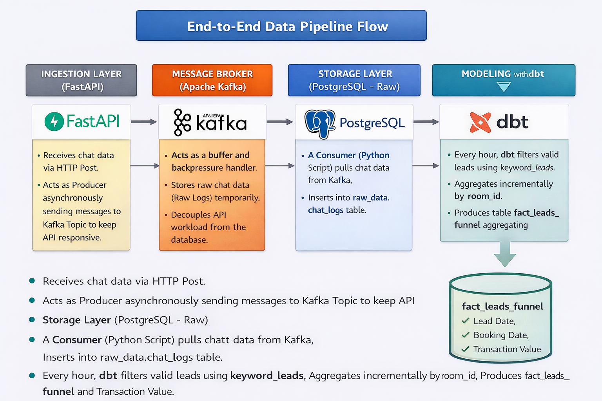
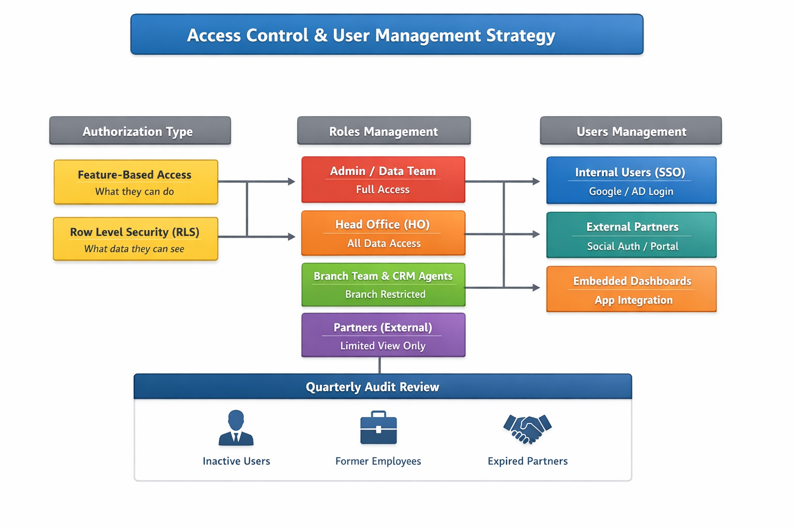

# Real-time Chat Analytics Pipeline



This project is a data engineering pipeline designed to ingest chat data from Kafka, identify leads based on NocoDB keywords, and process a marketing funnel (leads, booking, and transactions) using Prefect and dbt.

---

## Architecture Decision: Why Kafka?

While a direct FastAPI-to-Database approach is simpler, this project implements Apache Kafka as a message broker between the ingestion layer and the processing layer for the following reasons:

### 1. Decoupling
The ingestion API (FastAPI) is separated from the data processing logic. If the database or the dbt transformation fails, Kafka continues to collect and store incoming chat data without losing any records.

### 2. Backpressure Management
During high-traffic marketing campaigns, Kafka acts as a buffer, preventing the database from being overwhelmed by sudden spikes in message volume.

### 3. Scalability
Kafka allows multiple consumers (e.g., analytics, real-time alerts, or archival services) to read the same stream of data independently.

---

## Tech Stack

- **Orchestrator**: Prefect 3.0  
- **Transformation**: dbt-core 1.7.0 (Postgres adapter)  
- **Database**: PostgreSQL  
- **Message Broker**: Kafka  
- **API (Ingestion Layer)**: FastAPI  

---

## Prerequisites

Before starting, ensure you have the following installed:

- Docker and Docker Compose  
- Python 3.11+  
- Git  

---

## Setup and Installation

### 1. Clone the Repository

```bash
git clone https://github.com/adamaditamaa/pipeline_chat_realtime.git
cd pipeline_chat_realtime
```


## 2. Deployment with Docker
```bash
docker compose up -d --build
```


## 3. Running the Simulation

To test the pipeline with mixed data scenarios (lead, non-lead, purchase, and churn) for a duration of 80 seconds (you can adjust as much as you like):

```bash
python ./test_send_message.py
```

## 4. Technical Considerations

### 1. Incremental Strategy (Upsert)

The fact_leads_funnel table uses an incremental materialization strategy with:

unique_key = 'room_id'

When new messages arrive for an existing room_id (e.g., a customer proceeds from "lead" to "booking"), dbt will update the existing record instead of creating a duplicate.

This ensures that each room has a single, up-to-date row representing its current funnel status.

### 2. Flat Table Strategy

This project utilizes a single-table approach. The fact_leads_funnel table aggregates all stages—lead date, booking date, and transaction value—into a single flattened record to simplify reporting and visualization.


---

# Access Control and User Management Strategy



To ensure data security, proper governance, and controlled access across different business functions, this project also defines a structured authorization and user management strategy. The approach combines feature-level permissions with strict data-level restrictions to guarantee that users only access information relevant to their role and responsibility.

### 1. Authorization Type

I will use a mix of **Feature-Based Access** and **Row Level Security (RLS)**:

**Feature Access**  
Controls what users can do (e.g., view dashboards, explore data, or create new charts).

**Row Level Security (RLS)**  
Controls what data users can see. This is the most critical component. It ensures that, for example, a Branch Manager only sees data from their own branch—even if they use the same dashboard as Head Office.

---

### 2. Roles Management Strategy

Roles are categorized based on job function and data requirements:

**Admin / Data Team**  
- Full access to all data and features  
- Manage databases, SQL Lab, and build main dashboards  

**Head Office (Growth, Marketing, Operations)**  
- View access to all nationwide data  
- Can explore datasets and create charts  
- Cannot modify database configurations or core settings  

**Branch Team & CRM Agents**  
- View-only access  
- Data automatically filtered by their specific branch or region using RLS  

**Partners (External Users)**  
- Restricted view-only access  
- Limited to specific metrics relevant to their work  
  - Example: A Chef sees food sales  
  - Example: A Teacher sees student progress  
- Access provided through simplified dashboards  

---

### 3. Users Management Strategy

User management differs based on whether users have a company email:

**Internal Users (Head Office, Branch, CRM)**  
- Authenticate using Single Sign-On (SSO) such as Google or Active Directory  
- Role assignment is automated based on department when logging in with a work email  

**External Partners**  
- Authenticate via Social Auth (Gmail/LinkedIn) or a dedicated portal  
- Assigned restricted roles based on partnership scope  

**Embedded Dashboards**  
For partners, instead of creating separate Superset accounts, dashboards can be embedded directly into the application they already use.  
The host application manages authentication, while Superset securely renders the appropriate data.

**Audit Policy**  
Every 3 months, the user list will be reviewed to remove:
- Inactive users  
- Former employees  
- Expired external partners  

This ensures continued compliance, security, and proper access governance.